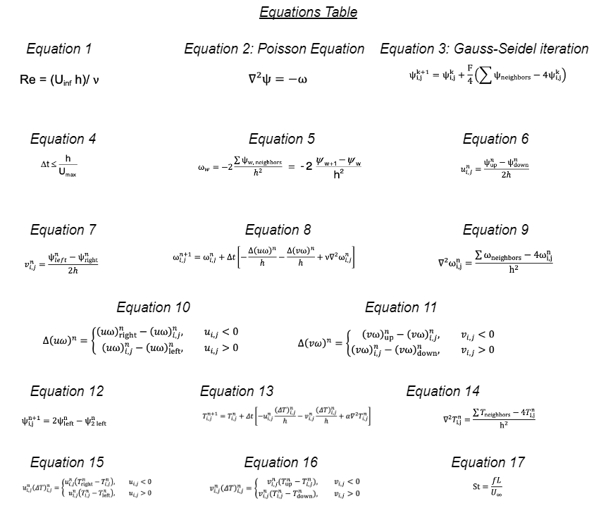

# Convective Flow Simulation
The goal of the project was to numerically simulate two-dimensional unsteady heat convection from bodies of arbitrary geometry. This involved the simulation of unsteady incompressible viscous flows with heat transfer at relatively low Reynolds numbers where three-dimensional effects may be negligible.

  
  

The project involved the implementation of the following heat flow equations in MATLAB:

  

